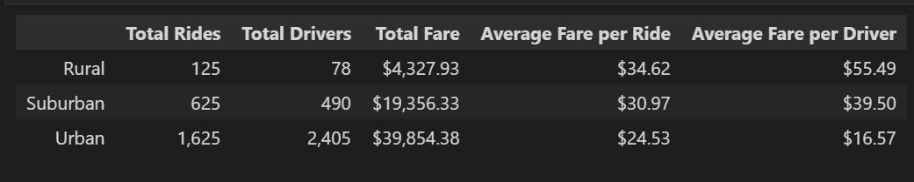
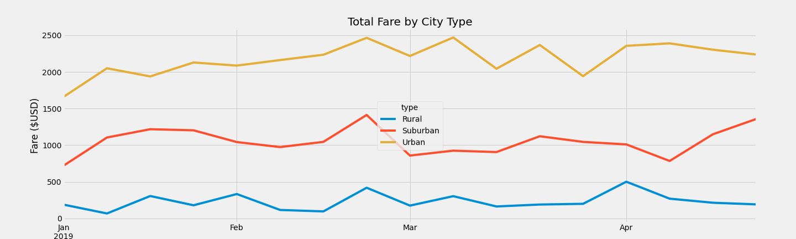

# PyBer Analysis

## Overview

This project aims to analyse data from a ride-sharing company to compare the performance in urban, suburban, and rural cities. The analysis used a jupyter notebook along with pandas and matplotlib to create comprehensive data frames and data visualisations. The complete analysis can be found in [PyBer_Challenge.ipynb](PyBer_Challenge.ipynb).

## Results

- Summary Data Frame

    - Reviewing the summary data frame, presented below, is possible to notice a significant difference in the numbers of rides and drivers in urban cities when compared to suburban and rural areas.
    - Although rural and suburban cities had fewer rides, the averages fare per ride is higher than in urban cities, which may indicate that the rides in rural and suburban cities are longer than urban rides.
    - Also, the average fare per driver in urban cities is considerably lower than in rural and suburban cities. That may occur due to the higher number of drivers in urban areas, which probably results in a smaller number of rides per driver.

    

- Fare Summary

    - The chart below shows how the total fare for each type of city varies in the first quarter of 2019. In urban cities is possible to notice that January has the smallest total fare in the period. Still, the values grow steadily in February, then drop again by the beginning of March, when ups and downs are present. In April the values present little variation but tend to lower levels by the end of the month.
    - For suburban cities, there are peaks by the end of February and April. But at the latest, the curve grows steadily, which may indicate that the level will be constant from that point. The lower levels can be seen by the beginning of January and April.
    - In rural cities, total fare value presents small variations all over the period, without any clear trend. The highest peak can be noticed by the beginning of April. However, it tends downwards right after.

     

## Summary

The analysis has shown that ride-sharing prevails in urban cities, but still, fares are higher in suburban and rural areas. Based on this scenario, some recommendations include:

- Focus on attracting new drivers in rural and suburban areas, expanding the offer of ride-sharing in these cities.
- Review fare policies to decrease the disparity between fare per driver in urban, suburban, and rural areas.
- Conduct further research to examine the reasons for variations in the total fare observed in the line chart.
